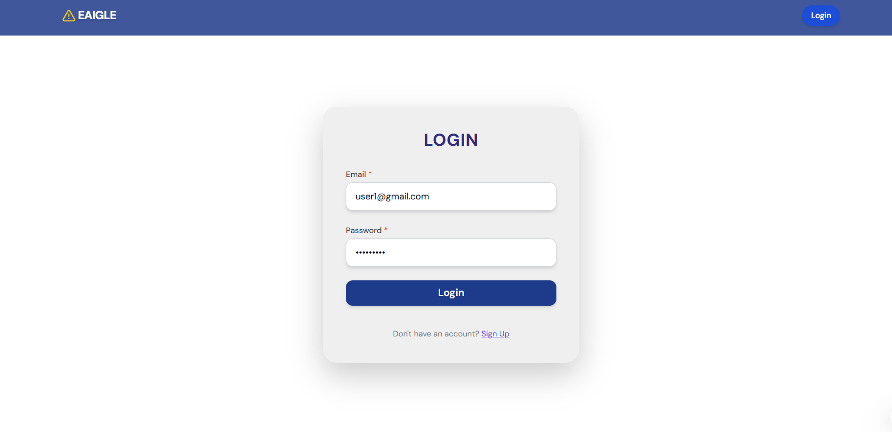
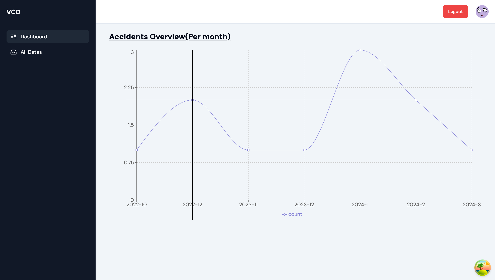
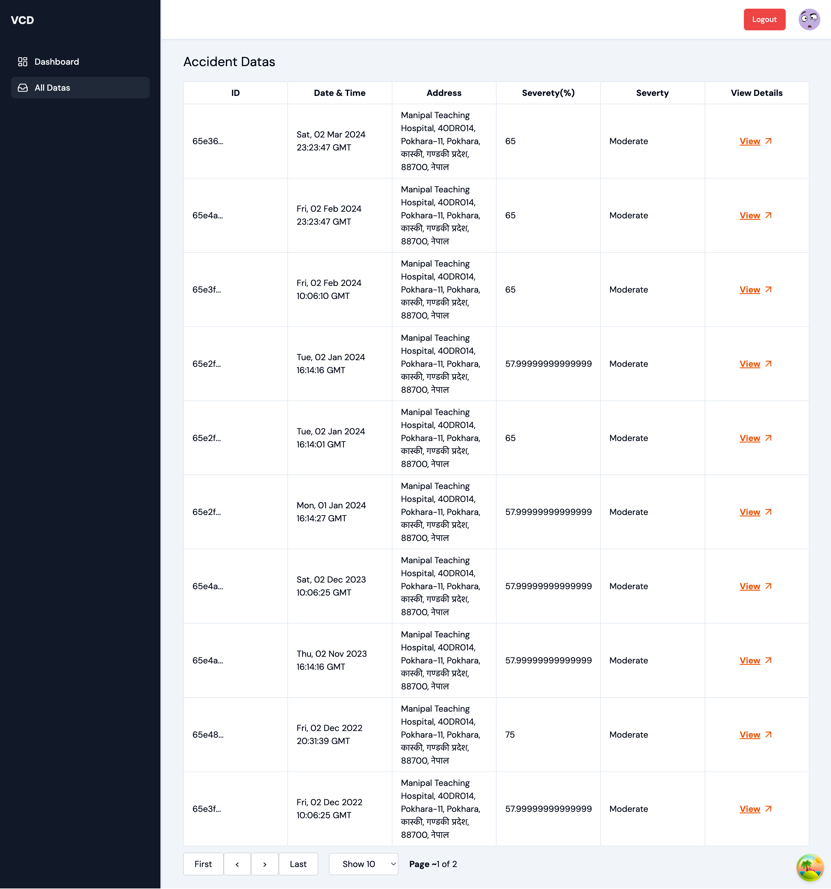
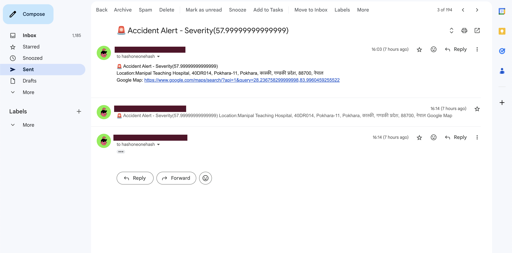

# AI- Powered Accident Detection and Location-Based Emergency Evacuation

A system that will continuously monitor for the accident through the CCTV installed and notify the concerned authorities for the instant rescue.

## Tech Stack Used

- Frontend
  - Next JS v.14
  - Tailwind CSS
  - TypeScript
  - Axios
  - React Query
  - React Hook Form
  - Leaflet
  - Recharts
- Backend
  - Flask
  - Python
  - MongoDB
  - Nodemailer
  - Cloudinary
- ML Model
  - YOLOv8
  - Roboflow

## Setup Guide

1. Firstly clone this repo locally(if you want you can fork it and clone it too) :
   ```
   git clone https://github.com/ebraj/Accident-Detection-Web-App.git
   ```
2. Once cloned successfully, open this project in your favourite IDE(VSCode in my case)

### Backend Setup

1. Once the above steps are done, open the terminal of your IDE and head over to the `server` directory using `cd server`
2. Then we will create the `virutalenv`. To create the `virtualenv` we will use the below command :

   ```
   # For windows
   python -m venv venv

   <!-- OR -->

   # For macos
   python3 -m venv venv
   ```

3. Once the `virtualenv` is created, we will activate it using the below command :
   ```
   source venv/bin/activate
   ```
4. And finally we will install the packages which are required for our project using the below command :

   ```
   # For windows
   pip install -r requirements.txt

   <!-- OR -->

   # For macos
   pip3 install -r requirements.txt
   ```

5. Create the `.env` file referencing to the `.env.example` file.
6. As everything is ready now, we can run the backend as

   ```
   # For windows
   python app.py

   <!-- OR -->

   # For macos
   python3 app.py

   ```

### Frontend Setup

The frontend setup is quite easy, unlike backend setup as it does not require any virtual env setup. Let's proceed to frontend setup.

1. Open the new vscode terminal, and head over into the client directory as `cd client` simply run the package installation command as
   ```
   npm install
   ```
2. Once the packages are installed properly, run the frontend application
   ```
   npm run dev
   ```
3. And you can view the page with the url `http://localhost:3000`
4. `Note`: We are using the Nodemailer service in the frontend also, so we need to setup the `.env` file for the frontend too(Reference to `.env.example` file).

## Final Setup(Model Implementor)

1. Setup the virtual environment like in the backend setup(Step 1-4).
2. And then run the application using `python app.py`


## UIS








## Team Members

<table>
  <tr>
    
    <td valign="top" align="center">
        <div>
          <br /><sub><a href="https://github.com/samir25141">Md Samir</a>
        </div>
    </td>
    <td valign="top" align="center">
        <div>
          <br /><sub><a href="">Md Shahjaman</a>
        </div>
    </td>
    <td valign="top" align="center">
        <div>
          <br /><sub><a href="">Md Junaid Ahmad</a>
        </div>
    </td>
</table>
